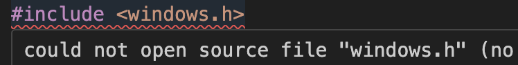
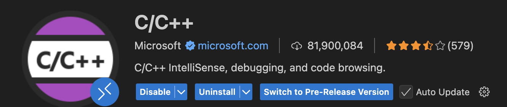
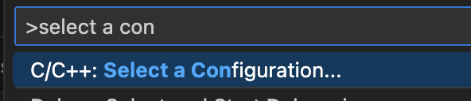
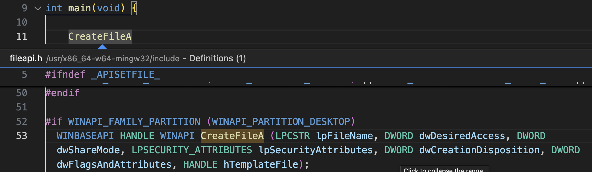
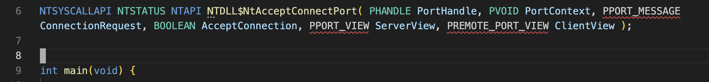

# How-To: Set Up VSCode for BOF Development

This guide will show you how to configure VSCode (not Visual Studio) for BOF (Beacon Object File) development. This is useful if you are developing in VSCode on Linux System as opposed to using Visual Studio on Windows.

> VSCode stands for Visual Studio Code. To not making this any more confusing than necessary, this article will refer to it as VSCode.

---

## 🎯 Goal
- Install the required extensions in VSCode
- Install BOF definitions that assist with BOF development
- Use templates to simplify the process

---

## 🔧 Prerequisites
- VSCode installed on a Linux system
   - This could work on Windows too, but the guide is tested on Linux only

---

### The problems we face
Once you start developing BOFs in VSCode you will notice that the formatter goes wild because you are not writing proper C and are doing all kinds of shenanings it does not expect.

Another challenge is that you constantly have to look up API docs, their prototypes and figure out their implementations, and make sure its all correct. It can sometimes feel like using laptop that has the screen facing in the wrong direction. (thanks AI!)

This article aims to introduce some VSCode configuration and tools that alleviate some of these challenges.

## Step 1: Install the C/C++ extension
Install the [C/C++ Extension](https://marketplace.visualstudio.com/items?itemName=ms-vscode.cpptools). You can do this with Ctrl+Shift+X and search for it.

## Step 2: Configure the compiler path for the extension
Configure the path of the C/C++ extensions' Compiler Path arguments to be representative of your MingW/etc, path. 
You can look this up by running:

`which x86_64-w64-mingw32-gcc`

which should return something like:

`/usr/bin/x86_64-w64-mingw32-gcc`

To configure it, press Ctrl+Shift+P and search for "C/C++: Select a Configuration"

From that manu, set the "Compiler path" to the path of the compiler identified in the previous step.

## Step 3: Install supplementary extensions
The project [BOF_NativeAPI_Definitions-VSCode](https://github.com/EspressoCake/BOF_NativeAPI_Definitions-VSCode) provides two VSCode extensions to assist with BOF development. We will get to what they do and how they work in a second.

Download the VSIX files from the Releases section on the Github repository.

Press Ctrl+Shfit+P and search for "Install from VSIX" an

After this, select the vsix file and press Install. Repeat the process for both vsix files.

### Step 4: Confirm that there are no more errors
After installing you should not have a ton of red squiggly lines complaining about regular things like including `windows.h` in your C files. This is a good sign. This is primarily resolved by pointing the C/C++ extension to the cross-compiler.

## Step 3 Confirm BOF definitions and prototypes work
The developer of these extensions included a [video](https://www.youtube.com/watch?v=oWss4Ac9Pl8) that demonstrates how this is supposed to be used. The guide below more or less re-iterates what is in the video.

### Step 3a: BOF definitions
The first extension, according to the developer, does the following:

> - Highlighted text representing a known Win32 API function is queried to identify the correct DLL it originates from
> - If successful, the DFR syntax for the function is displayed as a notification window
> - If successful, the relevant header file to include is displayed as a notification window

To verify you have these features installed and working, do the following:

Highlight a function call, for example `CreateFileA` and select "Peek -> Peek definition"

When you peek the definition, you can copy it to the C file.

Highlight the definition function name, press Ctrl+Shift+P and search for "Obtain External Definition".

Once you click it, you will see a VSCode notification with the correct DFR syntax and header file to include is shown.

You can then insert the header in your code, and update the DFR syntax with the DLL name.

### Step 3b: BOF prototypes
The second extension, according to the developer, does the following:

> Serves as a series of VSCode snippets in which:
>
> - NT/ZW functions prototypes are handled via bp_ prefixed strings
> - NT/ZW functions implementations are handled via bf_ prefixed strings
> - All implementations have sane default values to assist development

To verify this functionality, start typing `bp_` and you should see prototypes for a range of functions.
When selecting an entry, this should auto-insert the full prototype.

Similarly, when inside a function, you will see the same dropdown menu. But when selecting an entry, they will auto-expand to implementations instead of prototypes. 

)

---

## ✅ Summary
With these extensions, you get:
- Better formatting and error reporting when developing BOFs
- Great ergonomics and lookups of prototypes and implementations
- Easy lookup of API functions and DFR syntax.

---