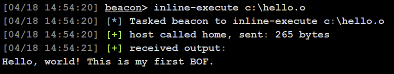

# Tutorial: Building Your First Beacon Object File (BOF)

This tutorial will walk you through creating your very first Beacon Object File (BOF), explaining the structure, build process, and how to run it in a C2 framework like Cobalt Strike.

---

## 🎯 Goal
- Understand what a BOF is and why it's used
- Write a simple "Hello, world" BOF
- Compile it using MinGW or clang
- Load it in a C2 framework (e.g. Cobalt Strike)

---

## 📦 Prerequisites

- Linux, or Windows with WSL
- `gcc` or `clang` (MinGW toolchain)
- A C2 framework like Cobalt Strike, Sliver, or Havoc (for testing)
- [beacon.h](https://github.com/Cobalt-Strike/bof_template/blob/main/beacon.h) — the header file that provides the Beacon API

Install MinGW if using Linux:
```bash
sudo apt install gcc-mingw-w64 -y
```

---

## 🛠️ Step-by-Step

### 1. Download the Beacon header file
Create a folder for your project

```bash
mkdir hello-bof
cd hello-bof
```

Download the Beacon header file
```bash
wget https://github.com/Cobalt-Strike/bof_template/raw/refs/heads/main/beacon.h
```

### 2. Create the Source File
Create a file called `hello.c` with the following code:

```c
#include <windows.h>
#include "beacon.h"

void go(char *args, int len) {
    BeaconPrintf(CALLBACK_OUTPUT, "Hello, world! This is my first BOF.");
}
```

In case its not obvious, the code simply prints a hello world type message.

> `go` is the entry point for all BOFs.

---

### 3. Compile the BOF
Use MinGW to compile it into a `.o` COFF object:

```bash
x86_64-w64-mingw32-gcc -c hello.c -o hello.o
```

> If targeting 32-bit systems:
```bash
i686-w64-mingw32-gcc -c hello.c -o hello.o
```

You now have a lightweight, position-independent object file.

---

### 4. Load into Cobalt Strike (or other C2 framework you have access to)

In a Cobalt Strike beacon:
```powershell
inline_execute hello.o
```



Congratulations! You have made your first BOF and executed it.

---

## 🧠 Tips & Gotchas
- Always use `BeaconPrintf` to output data
- Do not call `printf` or other console APIs
- Do not use global variables
- Avoid long-running loops — BOFs should return quickly

---

## ✅ What You Learned
- How BOFs work
- How to write a basic one in C
- How to compile it for use in a C2
- Basic conventions for output and entry points

---

Next up: Try creating a BOF that runs whoami. 

