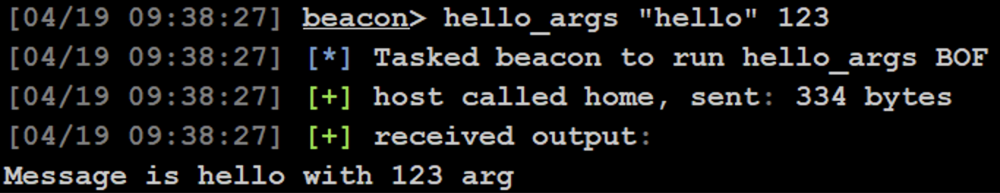

# Tutorial: Building Your First Argument‑Accepting BOF and Aggressor Script

This tutorial will walk you through creating a Beacon Object File (BOF) with arguments, explaining the structure, build process, and how to run it in a C2 framework like Cobalt Strike.

> If you have never made a BOF before, you might want to try out the first tutorial [Tutorial: Building Your First Beacon Object File (BOF)](../tutorials/tutorial-building-your-first-bof.md) before you try this one.

## About this tutorial

This tutorial extends the basic “Hello, world” BOF to:

1. **Accept and parse arguments** (string & integer) in your BOF 
2. **Register a custom Beacon command** via an Aggressor script 

Ultimately, its a pointless BOF from an operational perspective. It just serves as a typical programming example to teach the basics.

*Note*: This is almost identical to the article from the CS documentation found in [Aggressor Script and BOFs](https://hstechdocs.helpsystems.com/manuals/cobaltstrike/current/userguide/content/topics/beacon-object-files_with-aggressor-script.htm)

---

## 🎯 Goals
- Learn how to pass and parse simple arguments in your BOF  
- Create an Aggressor (`.cna`) script that:  
  - Registers a new Beacon command  
  - Loads your BOF once and caches it
  - Builds and passes the argument buffer to the BOF  

---

## 📦 Prerequisites
- Linux or Windows+WSL  
- gcc‑mingw‑w64 (or clang)  
- Cobalt Strike (or Sliver/Havoc)  
- [`beacon.h`](https://github.com/Cobalt-Strike/bof_template/blob/main/beacon.h)  

---
## 0. Preparations
Create a folder for your project

```bash
mkdir hello-args-bof
cd hello-args-bof
```

Download the Beacon header file
```bash
wget https://github.com/Cobalt-Strike/bof_template/raw/refs/heads/main/beacon.h
```


## 1. Create the source file
Create a new file: `hello_args.c`

```c
/*
 * Compile with:
 * x86_64-w64-mingw32-gcc -c hello.c -o hello.x64.o
 * i686-w64-mingw32-gcc -c hello.c -o hello.x86.o
 */

#include <windows.h>
#include <stdio.h>
#include <tlhelp32.h>
#include "beacon.h"

void go(char* args, int length) {
	datap  parser;
	char* str_arg;
	int    num_arg;

	BeaconDataParse(&parser, args, length);
	str_arg = BeaconDataExtract(&parser, NULL);
	num_arg = BeaconDataInt(&parser);

	BeaconPrintf(CALLBACK_OUTPUT, "Message is %s with %d arg", str_arg, num_arg);
}
```

1. `BeaconDataParse` initializes the parser. 
2. `BeaconDataExtract` pulls out the next string.
3. `BeaconDataInt` pulls out the integer.

---

## 2. Compile the BOF

In the previous tutorial, we compiled our BOFs using the command line, like this:
```bash
# 64‑bit target
x86_64-w64-mingw32-gcc -c hello_args.c -o hello_args.x64.o

# 32‑bit target (if needed)
i686-w64-mingw32-gcc -c hello_args.c -o hello_args.x86.o
```

We can also write a makefile with compiling instructions for both architectures

Create a new file called: `Makefile`
```make
BOFNAME := hello_args
CC_x64  := x86_64-w64-mingw32-gcc
CC_x86  := i686-w64-mingw32-gcc

.PHONY: all clean x86 x64

all: x86 x64

x86:
	$(CC_x86) -Os -c hello_args.c -o $(BOFNAME).x86.o

x64:
	$(CC_x64) -Os -c hello_args.c -o $(BOFNAME).x64.o

clean:
	@rm -f $(BOFNAME).*.o
```

Run `make` to compile. This will now output compiled BOF o-files for both architectures. 

---

## 3. Aggressor Script
To avoid having to write `inline-execute` with the full Beacon path every time, we can develop a so-called aggressor script in the Sleep programming language.

Create the file: `hello_args.cna`

```sleep
#
# Usage (within beacon console): hello_args "<message>" <number>
# Example:
#    beacon> hello_args "Fire in the hole" 31415
#
alias hello_args {
    # Declare local variables actually used
    local('$bid $barch $handle $data $args $msg $num');

    # Arguments are passed from beacon_command_register:
    # $1 = beacon_id
    # $2 = message
    # $3 = number

    # 1) Check argument count (beacon ID is implicit $1)
     if (size(@_) != 3)
     {
        berror($1, "Usage: hello_args \"<message>\" <number>");
        berror($1, beacon_command_detail("hello_args"));
        return;
    }

    # 2) Assign arguments
    $bid     = $1;
    $msg     = $2;
    $num     = $3; 

    # 3) Load the correct BOF based on beacon architecture
    $barch   = barch($bid);
    $bof_filename = "hello_args." . $barch . ".o";
    $handle  = openf( script_resource($bof_filename) );
    $data    = readb( $handle, -1 );
    closef( $handle );

    # 4) Pack the arguments: (string, integer)
    $args    = bof_pack($bid, "zi", $msg, $num);

    # 5) Execute the BOF
    btask($bid, "Tasked beacon to run hello_args BOF");
    # Entry point is "demo" from your C code
    beacon_inline_execute( $bid, $data, "demo", $args );
}

# Register the command so it's available in the beacon console
beacon_command_register(
    "hello_args",
    "Run the hello_args BOF example.",
    "
Synopsis: hello_args \"<message>\" <number>

Runs a sample BOF that takes a string and an integer argument.

Arguments:
    <message> - The message to pass to the BOF (enclose in quotes if it has spaces).
    <number>  - The number to pass to the BOF.

Example:
    hello_args \"Sending data\" 12345
"
);
```
The script does the following:
- Determines the architecture of the beacon (x64/x86)
- Loads the compiled `hello_args.x64.o` or the equivivalent for x86 from disk
- Packs the arguments using `bof_pack` with the correct formats: `z` for string and `i` for integer
- Run the bof with args using `beacon_inline_execute` 
- Register the `hello_args` with usage information in beacon

---

## 4. Load & Test

From Cobalt Strike
Open the Script Manager and Load your CNA script.


3. In a Beacon on a target, run:

   ```
   hello_args "hello" 123
   ```
And you should see output like this



---

## 🧠 Tips & Gotchas
- **Validate** argument count before parsing.  
- The **order** of `BeaconDataExtract` / `BeaconDataInt` calls matter. 
- Use `static` in Aggressor to avoid re‑reading the BOF file on each run.  
- For complex data (buffers, blobs), explore `BeaconDataPtr`.  

---

## ✅ Summary
- You’ve parsed string & integer arguments in your BOF.  
- You built a friendly Beacon command in Aggressor to wrap your BOF.  
- You now have a repeatable workflow for argument‑driven BOFs!  

```
